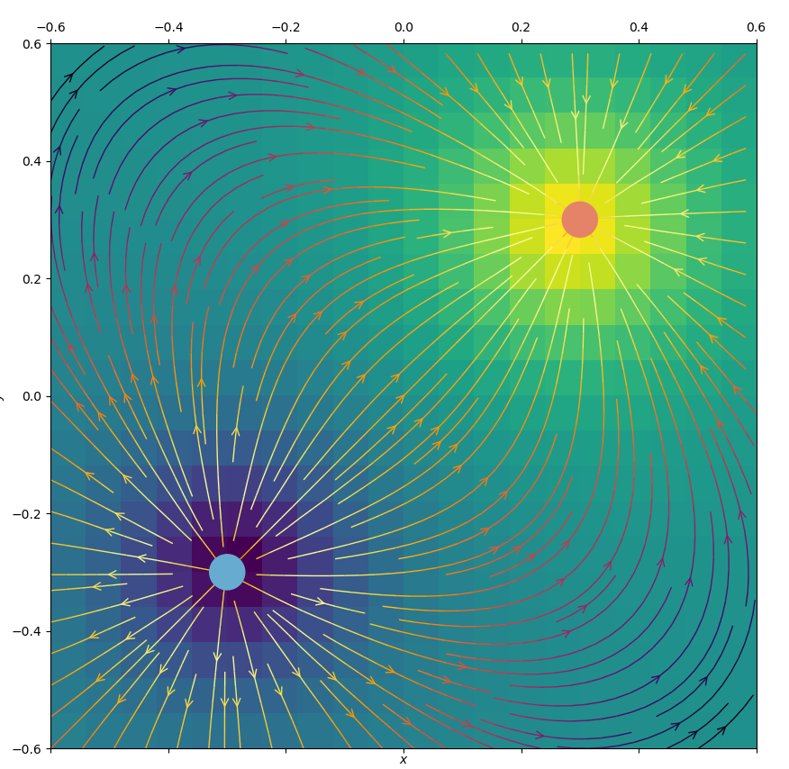
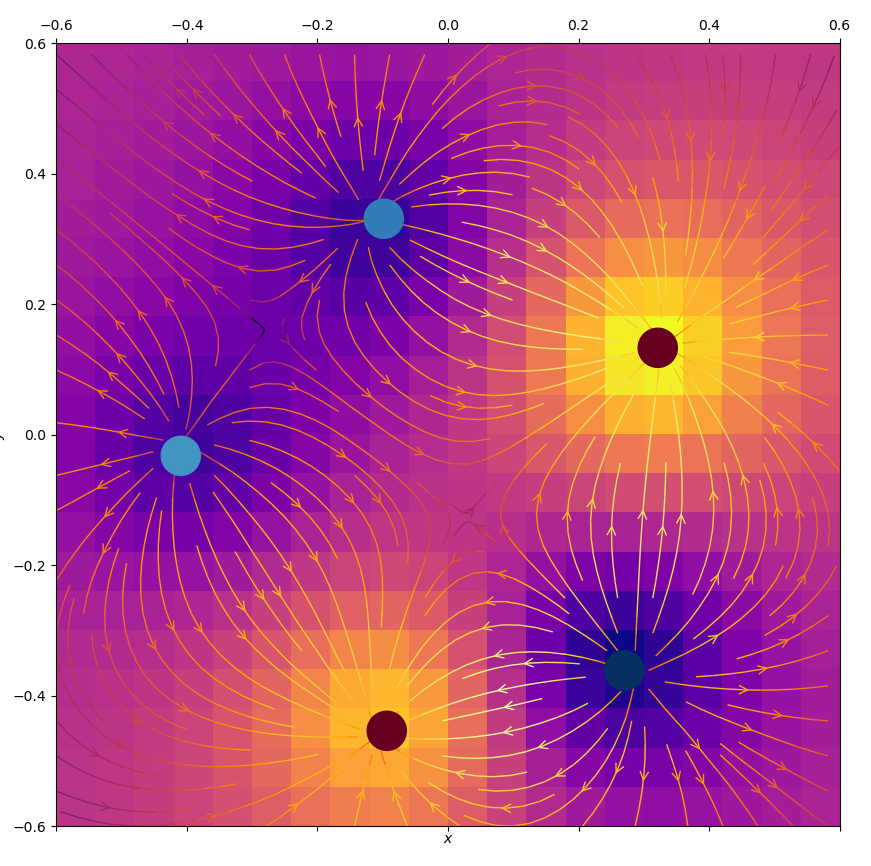

# Fields

## Python environment

**With conda:**

```
conda update conda
conda create --name py35 python=3.5
conda activate py35
conda install -c conda-forge matplotlib
conda install -c anaconda numpy
```

## How to use

```
from Renderer import *

system = System(8.85418782e-12, 0.04)
renderer = Renderer(system, 0.6, 0.6, 1.6, 20, 20)

renderer.system.addPoint(Point(-0.3, -0.3, 0.03, 0.55, 10))

renderer.launch()
```

## Examples

<p align="center"></p>

<p align="center"></p>

<p align="center"></p>
